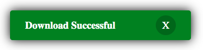
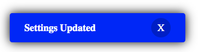

# Toasty
### This is a helper library for making beautiful toast messages to inform your website users of any updates or errors.<br>
#### Just import the library and in a few lines of code you have a beautiful toast message ready to greet your users. Just so to make your life easier, the library is highly customizable and more features will be added to this library in the forecoming versions.<br>
### Success Alert
<br>
### Info Alert
<br>
### Error Alert
<br>

## Importing the Library
```html
<script src=""></script>
```
## Using the Library
```javascript
//create a new Toast object
let toast=new Toast({
                message:'Download Successful',
                type:'success',
                duration:30000,
                animate:true
            });
//for customizing the toast, this function is not mandatory
toast.customize({
                bgcolor:'red',
                textColor:'white',
                borderRadius:'10px',
                position:'fixed',
                bottom:'20px',
                left:'20px'
            });
// finally display the toast on browser window
toast.show(()=>{
      // This Function will run after the toast has completed showing
});
```
